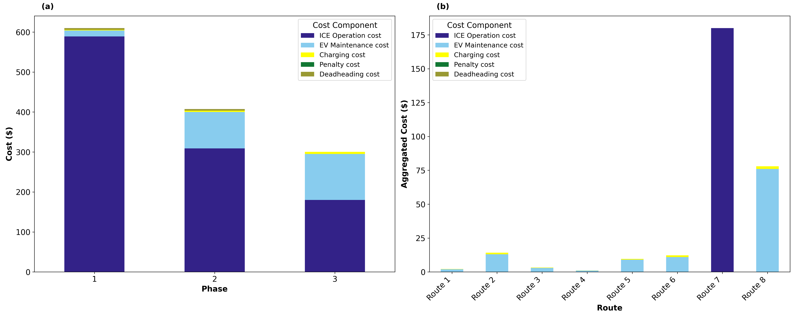
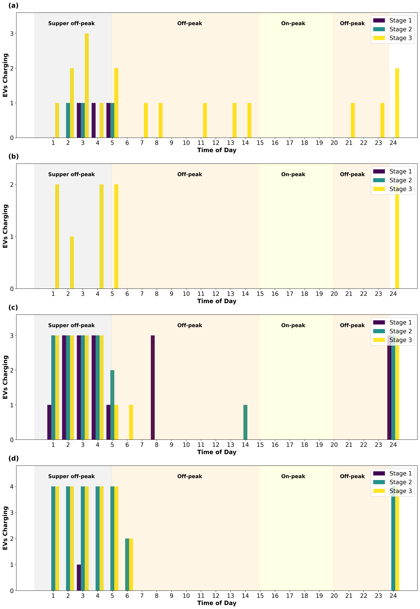

# EV Transition Optimization Tool

*This tool was developed as part of the **Transitioning to EV Fleets: Best Practices and a Decision Tool** project.*
* 📄 [Project Report Website](https://mdl.mndot.gov/items/202615)
* 📊 [Life Cycle Cost Calculation Tool](https://github.com/UMN-Transit-Lab/EV-Life-Cycle-Cost-Calculation-Tool)

Welcome to the **EV Transition Optimization Tool**! This project is designed to help organizations plan the best way to transition all their vehicle classes from gas/diesel vehicles to Electric Vehicles (EVs). 

Rather than guessing how many chargers to build or which groups of vehicles to electrify first, this tool uses a mathematical optimization engine to find the **most cost-effective transition plan** over several years/phases.

---

## 🎯 What Does This Tool Do?
Transitioning to an electric fleet involves a lot of complex decisions: 
- *When should we buy new Electric Vehicles?*
- *Where should we build charging stations?*
- *What type of chargers should we install?*
- *How many chargers do we need at each station?*
- *When should the vehicles charge to avoid high electricity costs?*

This tool takes your available **budget**, **vehicle groups (routes)**, and **costs**, and automatically generates a step-by-step master plan that answers all of those questions while minimizing the total cost.

---

## 📥 Inputs (What you configure)
The tool is powered by configuration files (ending in `.dat`, such as `parameters.dat`). In these files, you can define:
- **Vehicle Groups (Routes) & Fleet:** The groups of vehicle classes that use specific charging stations, the types of vehicles (Heavy-Duty, Medium-Duty, Light-Duty), and their energy consumption.
- **Costs:** The cost of buying EVs, building charging stations, electricity prices at different times of the day, and diesel maintenance costs.
- **Budget:** How much money is available to spend in each phase of the transition.
- **Locations & Capacity:** Potential of charging stations, including the maximum number of chargers they can fit and the maximum electrical power available.

> [!WARNING]
> **Hardcoded Naming Convention:** While the tool is highly flexible for adding new stations or chargers dynamically via the data files, there are two specific hardcodings to be aware of:
> 1. **New routes must end with a specific suffix:** The last part of any route name (e.g., `Cluster_0_H`) must end in `_H` (Heavy-Duty), `_M` (Medium-Duty), or `_L` (Light-Duty). Adding a completely new vehicle class like `Bus` (`_B`) requires modifying the `suffix_to_vtype` dictionary within both Python scripts (`model_design.py` and `Result_Table_Fig_Funcs.py`).
> 2. **Plot Formatting:** In `Result_Table_Fig_Funcs.py`, the `route_to_group` function maps specific route substrings (like `0_H` -> `Route 1`, `0_M` -> `Route 2`, etc.) to clean display names for the plots. If you add new routes and want them to appear as "Route 9" instead of their raw names in the plots, you must manually add them to this function.

---

## 📤 Outputs (What you get)
Once the tool finishes running, it generates clear, easy-to-read reports and visual graphs saved in the `Results` folder:

1. **Optimization Summary (`optimization_summary.csv`)**: A spreadsheet detailing exactly how many EVs to buy, how many chargers to install, and the budget spent in each phase.
2. **Detailed Results (`detailed_result.csv`)**: A comprehensive spreadsheet combining all the granular output (opened stations, electrified routes, fleet size, route-to-station assignments, charger installations, charging schedules, and ICE back-ups).
3. **Cost Breakdown (`Cost_breakdown.png` and `Cost_breakdown.csv`)**: A visual bar chart (and accompanying raw data file) showing where the money is going across different phases (e.g., Charging costs, Maintenance, Operations).
4. **Station Charging Activity (`station_charging.png` and `station_charging.csv`)**: A graph (and accompanying raw data file) showing what time of day vehicles are plugging in to charge.

---

## 🚀 Demo
Here is an example of what the tool produces after analyzing the inputs. It breaks down the costs by phase to help you understand exactly where your budget is going:  



It also creates detailed charging schedules that favor "Off-Peak" hours, to save as much money on electricity bills as possible:  



---

## 💻 How to Run the Code

Don't worry if you're not a programmer! Running the tool is straightforward.

### 1. Prerequisites
You will need to have Python installed on your computer, along with a few data science packages and an optimization solver.

1. Install [Python](https://www.python.org/downloads/).
2. Open your Command Prompt (Windows) or Terminal (Mac) and install the required packages by running:
   ```bash
   pip install pyomo pandas matplotlib numpy
   ```
3. Install an optimization solver. The tool is currently set up to use **Gurobi** (an industry standard). You can download a free academic or evaluation version from [Gurobi's website](https://www.gurobi.com/) and follow their installation instructions. 

### 2. Running the Tool
1. Download or clone this project folder to your computer.
2. Open your Command Prompt/Terminal and navigate to the project folder. For example:
   ```bash
   cd path/to/Github
   ```
3. Run the main Python script:
   ```bash
   python model_design.py
   ```
4. Sit back and relax! The tool will process the numbers and print its progress to the screen. 
5. Once finished, open the **`Results`** folder to view your newly generated spreadsheets and graphs!

---

## 📁 File Structure Overview
- `model_design.py`: The main optimization script that also considers different charger types (e.g., fast vs. slow chargers).
- `parameters.dat`: The main input file containing all the numbers and costs.
- `Result_Table_Fig_Funcs.py`: The helper code that draws the beautiful graphs and formats the Excel tables.
- `Results/`: The folder where all output files and pictures are saved.
